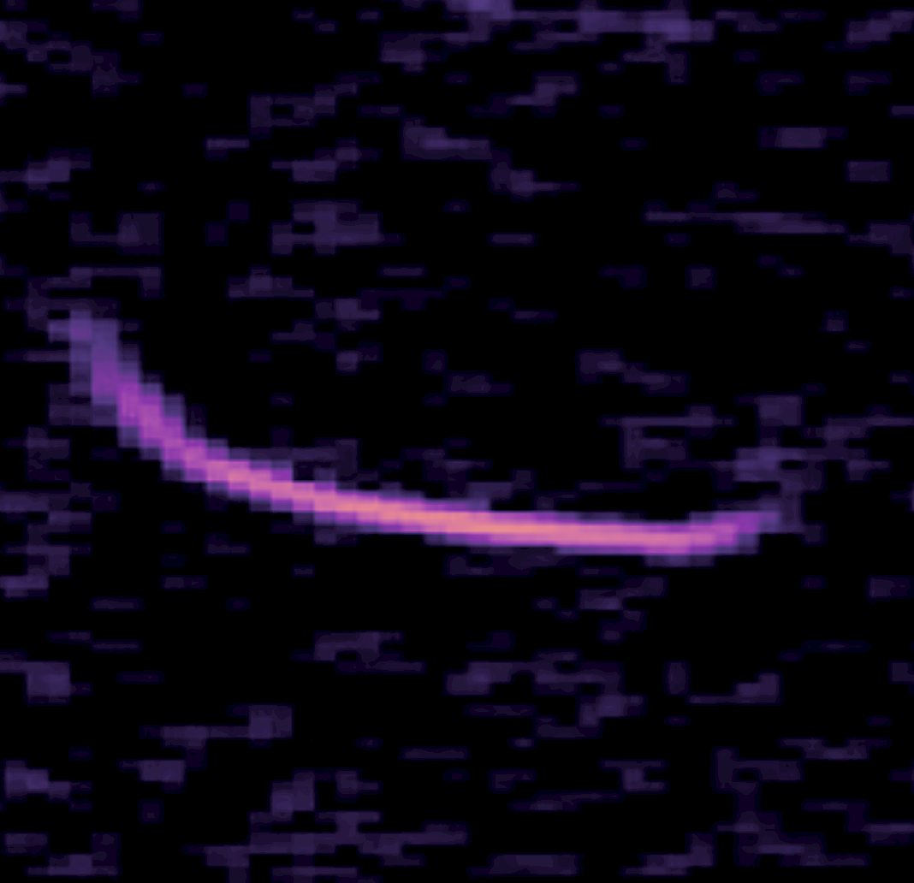
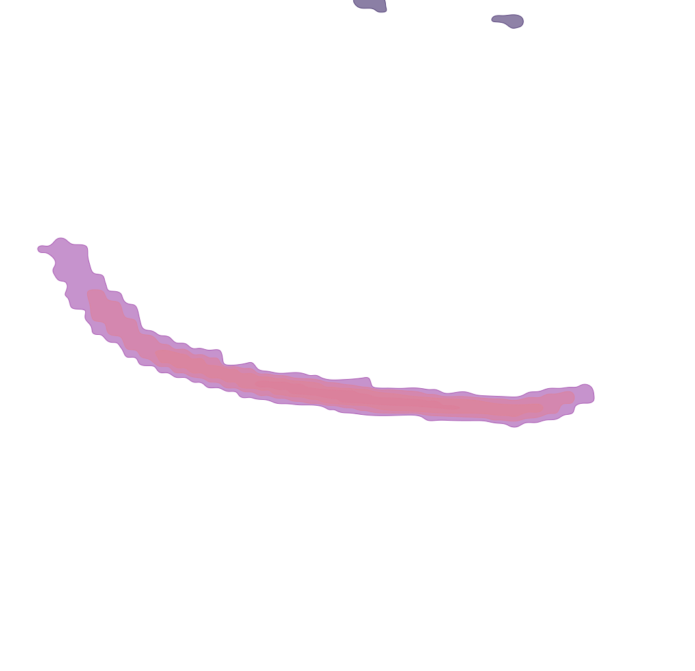

Generate smooth, color-filled iso-contours from spectrograms or any grayscale raster using OpenCV, SciPy, and scikit-image.


*Default input (`spectrogram.png`)*  


*Sample marching-squares SVG output*

## Features
- **Multi-level iso-contours** via OpenCV thresholds with spline smoothing.
- **Marching-squares contours** powered by `skimage.measure.find_contours`.
- **Edge-based contours** from Canny edge detection.
- **Color-aware SVG export** that samples the source image to fill each contour with the dominant interior color.
- Preview image overlay (`contour_preview.png`) for quick visual validation.

## Requirements
- Python 3.12 (tested)  
- Dependencies (install via `pip`):
  - `opencv-python`
  - `numpy`
  - `scipy`
  - `scikit-image`
  - `svgwrite`

An isolated environment is recommended (the repo ships with `mydev/` virtualenv scaffolding if you want to reuse it).

## Setup
```bash
cd your_preferred_path
# optional: create/activate your own venv
python -m venv .venv
source .venv/bin/activate
pip install -r requirements.txt  # create this file or install deps manually
```

If you keep the existing `mydev` virtual environment, activate it with:
```bash
source mydev/bin/activate
```

## Usage
Place the input raster (default: `spectrogram.png`) in the project root, then run:
```bash
python contour_tools.py spectrogram.png \
  --smooth-svg smooth_contours.svg \
  --edge-svg edge_contours.svg \
  --marching-svg marching_squares_contours.svg \
  --preview contour_preview.png
```

Omit the arguments to rely on the defaults shown above.

The script executes three contouring pipelines:
1. **Multi-level thresholds** → `smooth_contours.svg`
2. **Edge-based contours** → `edge_contours.svg`
3. **Marching squares** → `marching_squares_contours.svg` (example shown above)

A preview PNG (`contour_preview.png`) overlays the marching-squares (or fallback multi-level) contours on the original image.

### Customizing
Edit `contour_tools.py` constants/parameters to tweak behaviour:
- Percentile thresholds for each method.
- Minimum area filters to drop noise.
- Spline smoothing factor.
- Sampling radius and shrink distance for color extraction.
- Marching-squares level selection modes:
  - `--level-mode percentile` (default) with `--percentiles`
  - `--level-mode multi-otsu` with `--multi-otsu-classes`
  - `--level-mode histogram` groups histogram bins until the within-band variance exceeds `--hist-variance`; tweak with `--hist-bins`, `--hist-sigma`, `--hist-variance`, `--hist-max-levels`

Each extractor returns contours sorted by descending percentile, while the SVG writer draws them from low to high so higher-value regions stack on top.

## How It Works
- **Smoothing**: contours are closed, then `scipy.interpolate.splprep` with `per=True` builds a periodic B-spline; `splev` resamples a smooth polyline. A fallback preserves the raw contour if fitting fails.
- **Color sampling**: `save_contours_to_svg` erodes the polygon mask, runs a distance transform to find the most interior pixel, samples a small neighbourhood around it, and averages the colors to derive an RGB hex used for both fill and optional stroke.
- **Marching squares**: `skimage.measure.find_contours` extracts level sets directly from the blurred grayscale image, giving cleaner iso-lines than threshold masks alone.

## Development Tips
- Always re-run the script after parameter tweaks to regenerate SVGs/preview and check color fidelity.
- Keep the repo clean: inspect `git status`, run linters or formatters if you introduce new changes.
- When renaming or reorganising files (e.g., `contour_tools.py`), update documentation and any entry points before committing.

## License
Apache 2.0

